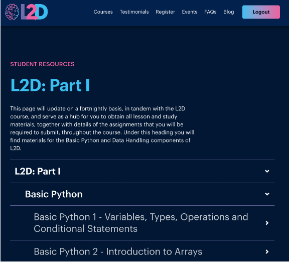
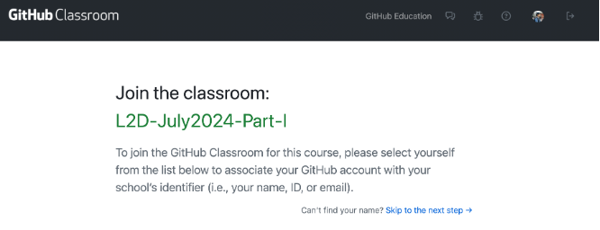
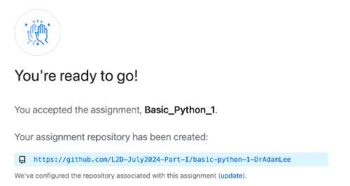
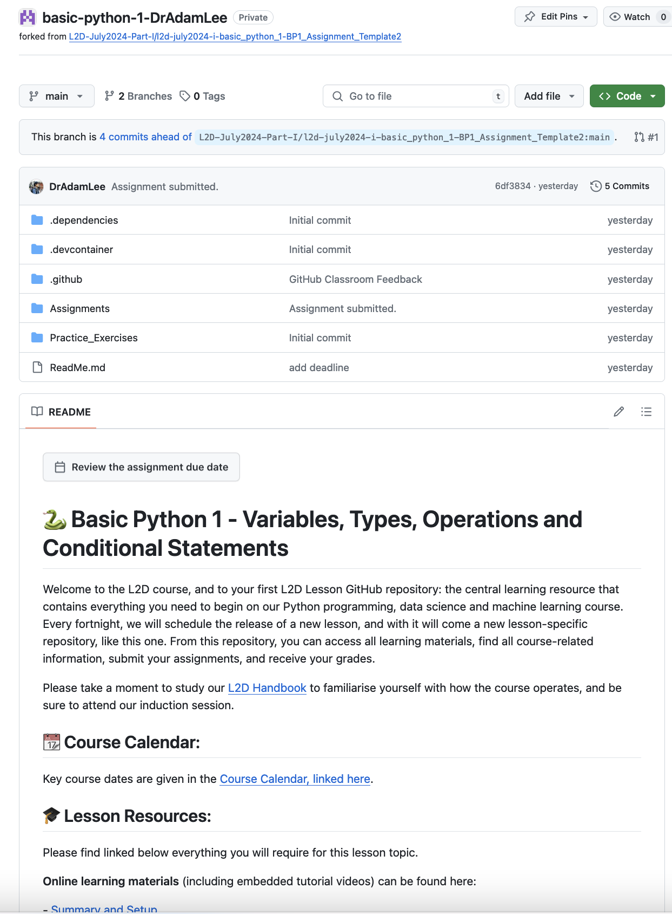

## L2D Lesson Portal

The L2D course is centred around two pages: 

* Lesson Portal  
* GitHub Repository 
 
In your L2D lesson release email, you will find a link to the [**L2D Lesson Portal**](https://learntodiscover.ai/login/). This contains a hierarchical menu of all lesson topics available on the course package you have purchased. As you progress through the course, each fortnightly lesson release will appear on the Portal, added into the lesson and topic hierarchy.  

## GitHub Clasroom

 **Accepting an assignment and creating your GitHub lesson repository**

1. When you click on a lesson for the first time, you will be asked to accept your lesson assignment via GitHub Classroom: you must be logged into your L2D-invited GitHub account in order for this to work. 

You will see a list of names of all the registered students. Find your name and click that. This will result in the creation of assignment repository as shown below in the image.  

2. Once your repository has been created, click the blue shaded hyperlink that contains a unique URL to your own GitHub repository of resources for an entire lesson topic’s worth of learning will be created, automatically.  

The image to the right shows a sample of what your repository home page looks like.  

 
::::::::::::::::::::::::::: callout
## Information
The hierarchy of its contents is shown in the middle of the screen, with a column showing the most recent commit message, and a column showing the date of that commit. A commit, in GitHub terminology, is a logged change made to a file or folder. These commit messages will be encountered again, when you work on your first assignment, instructions for which will be given later in this handbook. 
:::::::::::::::::::::::::::

On a per-lesson basis, you will find the following resources within each GitHub repository. 
 
- **Assignments:** This folder contains blank assignment templates for you to fill out and submit before your submission deadline. Assignments are typically graded within 14 days of timely submission, and these are made available, here. 

- **Practice_Exercises:** This folder contains Practice exercises found in the written materials, are made available in this folder as interactive Jupyter Notebook files. (Note: This folder is not available in all lesson topics). 

- **Instructions:** This folder contains the Student Handbook. 

- **Lecture_Resources:** This folder contains any data or Jupyter Notebooks that are demonstrated during the live lecture for the associated lesson. These can be useful if you wish to code in tandem with your L2D Instructor during a lecture. 

- **ReadMe:** This is a document that will display on the home page of your GitHub repository, beneath the repository contents, and contains all the useful links and information relating to the selected fortnight’s learning. This includes links to written materials, times and links to live lectures and drop-in sessions, as well as contact details for reaching us. 
 
::::::::::::::::::::::::::: callout
## Note
There are other folders in your repository whose title begins with a full stop. These are developer folders that we use to support the online environments that you will use for working on your assignments. Please do not touch or modify these. 
:::::::::::::::::::::::::::
