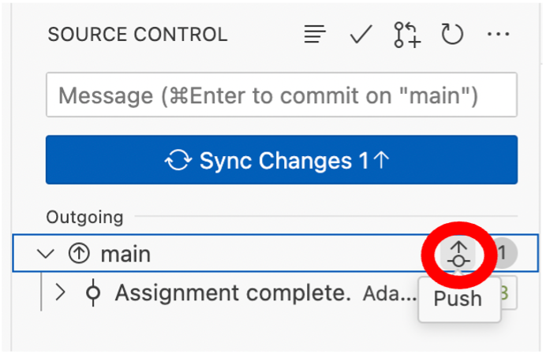

## Assignment Submission

As you progress through the L2D course, you are expected to complete one assignment per fortnightly lesson release. Assignments are template Jupyter Notebook (.ipynb) files found in your Assignments folder, and consist of a set of questions related to the fortnight’s lesson topic. You should complete these with the knowledge you have gained from consuming L2D’s written materials, tutorial videos, live lectures and drop-in sessions.  
 
Assignments are due to be submitted before the next lesson topic release date. For instance, as lessons are released on Mondays, you must submit them before 00:00, 14 days after. Timely submissions result in graded assignments and feedback being returned to you within a further 14 days. If you submit an assignment late, it will not be prioritised by our tutors, and in certain cases, this may affect or delay the issue of any L2D certificates. If you are facing extenuating circumstances and require an extension, please let us know by contacting admin@learntodiscover.ai. 

### **How to submit an assignment**

Below are a set of **step-by-step instructions** showing you how to submit an assignment. At L2D, we make use of GitHub Codespaces, which allows you to set up an online instance of Microsoft Visual Studio Code, and code directly from within your web browser. We recommend the use of **Google Chrome**, for stability and ease. 
 
Firstly, let’s familiarise ourselves with the **Assignments** folder, which can be found inside your lesson repository. The example below shows the Basic Python 1 (BP1) lesson repository. 
 
 

Inside your **Assignments** folder, you will find: 
 
A **ReadMe** file that (as with your main repository page) is displayed beneath the folder’s contents. 

A **Data** folder that contains any data that may or may  not be required to complete the assignment.  

A **Feedback** folder, that will contain your marked assignment, once it has been graded and returned to you. 
 
### **Completing an Assignment** 
 
1. To begin an assignment, you must first create a new Codespace, by clicking the green Code button, selecting the **Codespaces** tab, and clicking the green Create codespace on main button: 

 

2. This will begin setting up a Codespace for you to work in. This may take several minutes to complete: please be patient. The total time it takes to set up your Codespace could also be affected by the speed of your internet connection. If you would like to monitor progress of the setup, click the blue Building codespace hyperlink at the bottom right of your screen to display the setup log in the terminal tab.  

3. Once your Codespace has been set up, you will see the hierarchy of your entire lesson repository on the left in the **Explorer** tab. Uncollapse the **Assignments** folder, and there you will see your assignment template notebook. Click on this, and it will open in the main view, in the middle of the window. Note: the ReadMe file may open and come into view – close this tab, and focus on your assignment. 

4. Next, you must click on **Select Kernel** on the far right of the window. A dropdown menu will appear in the middle of the window: click **Install/Enable suggested extensions**. Wait a short moment while these install (progress is indicated, bottom right). 

 

5. You must then click **Python Environments…** in the dropdown menu in the middle of the screen. (If this has disappeared, you can bring it back by clicking **Select Kernel** again). 

 

 

6. You will then see an option with a star by it that says **l2dVE** (L2D Virtual Environment). Click this to select a pre-prepared environment that we have set up for you, with all the required Python packages and modules you will need to work on the specific assignment in question. (Once selected, the active kernel on the right will display **l2dVE** and the current version of Python being used). 

 

7. You are now ready to begin the assignment. You can create new cells easily by pressing the **+ Code** button. You can then fill these with code, and run the code by clicking the little triangular **play symbol** to the left of the cell (or using keyboard shortcut **ctrl + Enter**). The output of your code will then be generated and displayed beneath the cell. 

 

::::::::::::::::::::::::::: callout
## Note
only complete the next steps in the workflow when you are ready to submit your assignment. If you wish to pause working, and come back at a later time – providing you have a stable and active internet connection – your Codespace will autosave your changes as you are working. If you reopen the Codespace you created from your main repository page again, you will be able to pick up where you left off. To access your Codespace at a later date, go back to your main repository page, and click the green Code button. Under the **Codespaces** tab, you will see any active codespaces that you have in your repository. They will usually be given random, meaningless names to help GitHub uniquely identify them. Click this name, and you will be able to resume where you left off.  

 
:::::::::::::::::::::::::::

8. Once you have completed your assignment, you must then proceed to submit it. To do this click the **Source Control** button on the leftmost tab (a fork symbol), and you will see that – because you have made changes to your assignment template file – a sub-menu titled **Changes** will appear, and under it will be your assignment template file with a small green U to the right of it. This means that there are unstaged changes that have not yet been pushed back to your repository.  

 
You must first stage a change, commit it and then push this change back to your repository in order to submit your assignment. If you mouse-over the title of the document, you will see a + symbol appear. Click this + symbol, and it will stage the changes made to your assignment. 
 

9. Once staged you must commit the changes, and add a commit message. GitHub is based around an efficient version control system, which allows you to add messages to every change made to a file, and keeps a detailed history of all changes made, so that you can easily see every version of a file, at the different stages at which it was worked upon and edited. Click in the **Message** cell, write down a relevant commit message (i.e. ‘Assignment completed’), and hit the blue Commit button.  

10. In order to complete the submission process, you must push your completed assignment back to your repository, and it will register with us that you have submitted the assignment. Mouse-over **Main** and you will see a symbol of a node with an **arrow**. Click this **arrow** to push your assignment back to the repository, and your submission will be registered. Alternatively, you can also click the blue Sync Changes button, which has the same function.

11. After you have submitted your assignment, the final step is to delete your codespace. **You must do this**, as having too many active codespaces places heavy strain on your GitHub account. To delete your codespace, go back to your main repository, click the green Code button, and select the **Codespaces** tab. Find your active codespace(s), click the three dots … beside it, and select Delete from the dropdown menu.  

Initially, for users new to GitHub, this workflow may seem a little daunting. But we encourage you to keep this handbook to hand, so that you can get used to this system of submitting assignments. At L2D, we have selected this protocol for assignment submission to familiarise learners with GitHub’s infrastructure so that – for those who pursue coding in the future – you will be armed with the knowledge of how to use a platform and system for code sharing, collaboration and publication that is recognised and used, internationally. 

