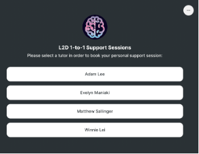
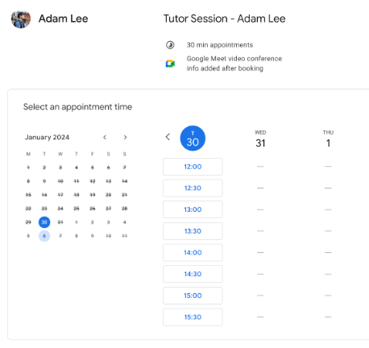
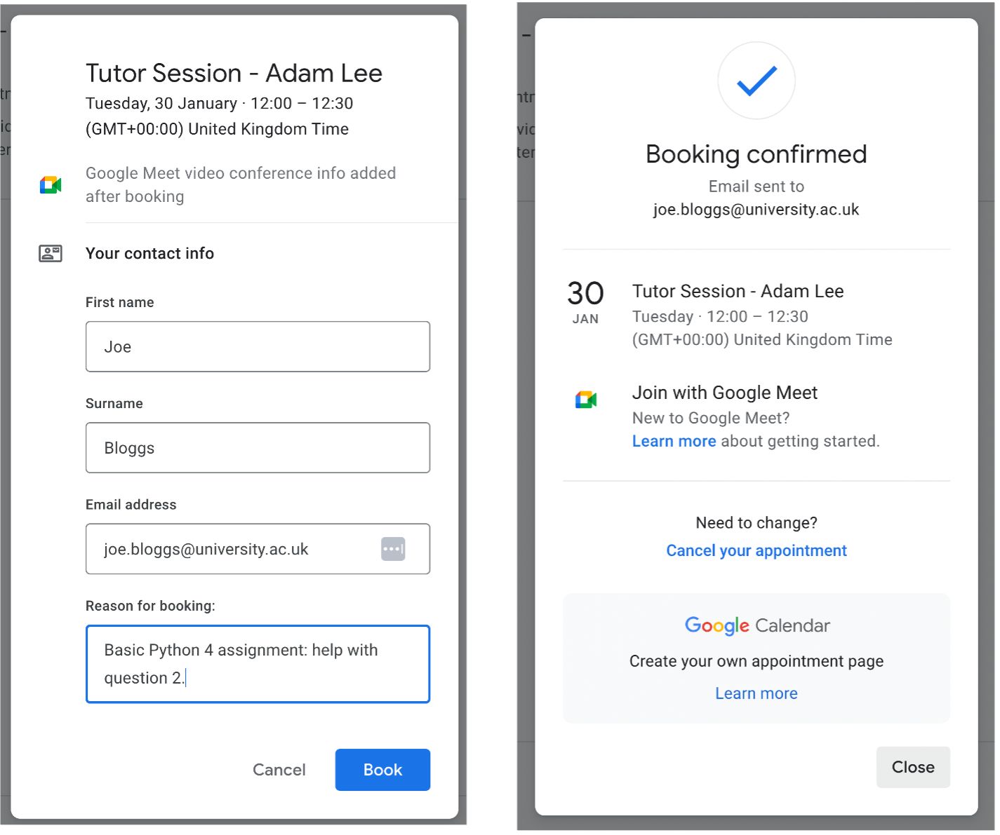

### Booking Sessions

L2D now offers the chance to book a 30-minute, 1-to-1 discussion between students and tutors. This is aimed at allowing students with particular queries to have these answered and walked-through with an L2D tutor. As an example, these queries can either be about a subject area, assignment question, or final project.  
 
Please refer to this instruction document to help you book sessions with a tutor of your choice. 
 
1. Click on the following URL (and bookmark it for safekeeping): 
https://linktr.ee/L2DTutorSessions

2. From the list, select a tutor of your choosing to see their availability. Please note, if one tutor’s availability is not convenient for you, it’s a good idea to check on the others in the list, for a wider array of support slots. 

 
3. Each booking consists of a 30-minute slot. Select a slot that is convenient for you. Typically, we make slots available one week at a time. 

4. To book a slot, click the time of your choosing, and fill out the form with your name, email address and the reason for your booking. (Tip: give 1-2 sentences in the last field, to help your tutor know what the support session will be about). 

{height=477px width=570px}

You should then receive an automatic calendar invite to the provided email address. When the time for your support session arises, it will take place on the automatically provided Google Meet link, which will allow you to engage in a video meeting with your tutor, directly from your web browser. No additional software or sign-ups are required. 
 
If you have any questions regarding your tutor support session, please email us on: admin@learntodiscover.ai 
