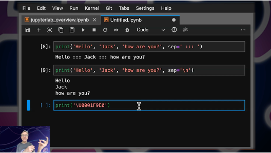

Each Thursday on the week of a lesson release, we hold a live lecture for the L2D course. This runs on Zoom, on the following link, at 14:00 GMT/BST (or as indicated in your lesson release email and GitHub repository ReadMe): [Live Lecture Zoom Link](https://ucl.zoom.us/s/93522532680#success)

These lectures are recorded, edited and made archival onto YouTube playlists that you will be able to watch, typically a few days after they were streamed. These playlists are linked in your lesson release email, and on the ReadMe files that front each GitHub repository. We will also announce published lecture videos on the GitHub Discussions forum. These videos are made available to you, indefinitely.  
