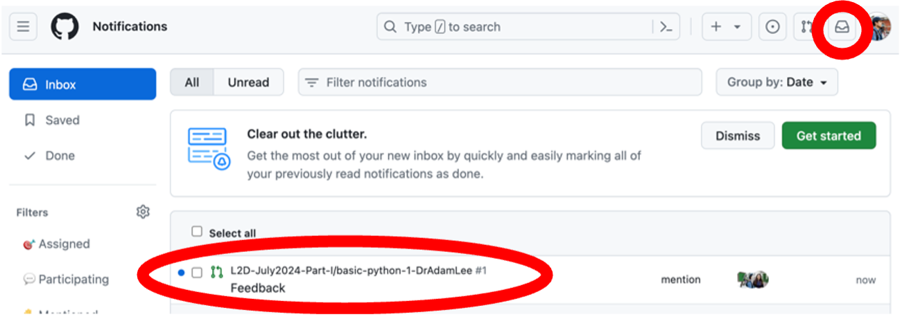
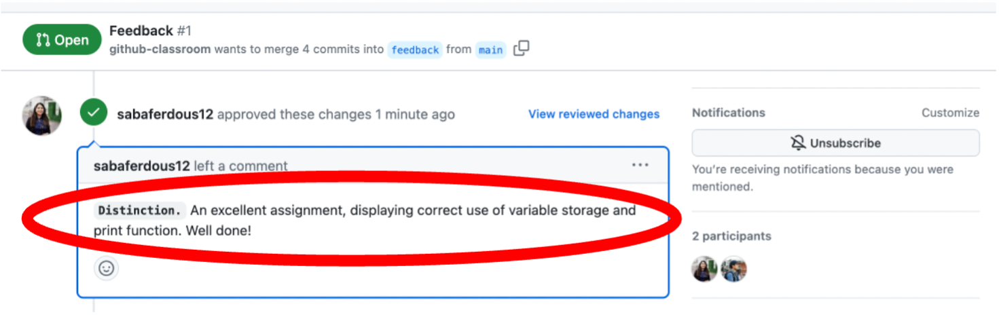
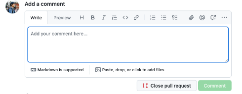

## Marked Assignments

Once your assignment has been marked, it will be returned to your repository by your L2D tutor within 14 days of timely submission. The file will have **_MARKED** appended to its title, just before the file extension, and will be returned to the **Feedback** folder on your lesson repository. Inside your notebook, you will find comments initialled by your tutor in your work and code, indicating your progress. For example, a line commencing with # AL: would indicate that your tutor (initials AL) is leaving you in-line feedback.  

Also inside your Feedback folder, you will see a ReadMe file, which explains each grade boundary, and how these grades reflect the application and understanding demonstrated in your work. Your L2D assignments are assigned one of three grades: **Distinction**, **Pass** or **Revise**.  

Your L2D tutor will also leave a summary comment on your work, and grade as a GitHub Pull Request. Once this has been submitted, you will receive a notification in your GitHub inbox (top right of any GitHub window), and you will also receive an email to your GitHub-registered email address, indicating that a Pull Request has been submitted by your tutor. If you received a Distinction or Pass, no further action is required, on your behalf. However, should you receive a Revise for your work, you are expected to re-attempt your assignment, as per your tutor’s guidance, and re-submit this within 14 days of receiving your marked assignment. 

 
 
## Revising an assignment

Just as previously described for submitting an assignment, you are required to use your Codespace to open the marked assignment that was returned to you by your L2D Tutor. 

1. Make a copy of this by right-clicking the file name in the browser tab on the left of your Codespace window, and click **Copy**. Right-click again, and click **Paste**. Right-click the copy of your assignment, and click **Rename** and replace _MARKED with _REVISED. 
 
2. Revise your assignment, as advised by your Tutor, and when you have completed your revisions, submit your revised assignment in the same way as you have done before, by staging the stages, committing and pushing your _REVISED notebook with a sensible commit message (such as ‘Assignment revised.’). 
 
3. Once you have pushed and submitted your assignment, go back to the Pull Requests tab, find the Feedback left by your tutor, scroll down and you will see a blank **Add a comment** field. In this, reply to your tutor, saying you have revised your assignment, and your tutor will automatically be notified of your revisions. Please note, this step is critical. Without it, your tutor won’t be notified that you have submitted a revised assignment, and will not know to re-mark this.

Once your assignment has been revised, it will be returned to you in the same way, with your tutor adding a comment to the same Pull Request, culminating in you receiving a notification and email. Once your assignment has achieved either a Distinction or a Pass, you will not be required to submit any further revisions. 

::::::::::::::: callout
## Note

As previously advised, please be sure to submit your revised assignment within 14 days of receiving your mark from your tutor. Delayed assignment and/or revision submissions will not be prioritised by our tutors, and if the workload for them is high, this may (without reported extenuating circumstances) result in delayed issuing of certificates for your completion of the L2D course.
:::::::::::::::